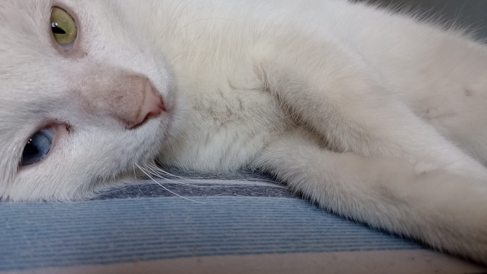

# Juan Ruiz Diaz Benegas

Hola, me llamo Juan y actualmente estoy cursando mi cuarto o quinto cuatrimestre; ya no lo recuerdo bien. Terminé la secundaria en 2021.

Luego, me inscribí en la Universidad Nacional de Hurlingham (UNAHUR) en la carrera de Programación. Aunque por la frustración algunas veces se me pasó por la cabeza abandonarla, sigo adelante y, a estas alturas, no pienso dejarla.

Mi meta es poder trabajar desde casa con un sueldo decente, y espero algún día tener los conocimientos necesarios para trabajar en grandes proyectos.

El es mi gato Gaspar

## Algunos datos míos
* Me gusta entrenar
* No me gustan mucho los juegos online, prefiero los single player
* Me gusta ver documentales

